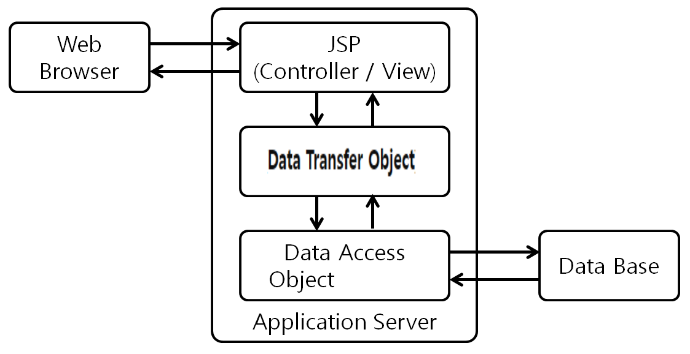

# JSP CRUD 게시판 

## 🖥️ 프로젝트 소개
JSP Model1 기반 게시판입니다 

## 🕰️ 개발 기간
* 24.04.26일 - 22.05.24일

### ⚙️ 개발 환경
- `Java 8`
- `JDK 1.8.0`
- **IDE** : Eclipse 
- **Database** : MySQL
- **ORM** : Mybatis
- **Server** : tomcat

## 프로젝트 구조 
!
!

#### 작성

	
SQL 쿼리문 

    
        INSERT INTO board (b_title, b_content, b_date)
        VALUES (#{bTitle}, #{bContent}, NOW() );
   

- 
#### 삭제 - 

	
SQL 쿼리문 

    	DELETE 
    	FROM board
    	WHERE b_id=#{bId}
   

- 
#### 수정 - 
-

	
SQL 쿼리문 

    
    	UPDATE board
    	SET b_title=#{bTitle},
    		b_content=#{bContent}
    	WHERE b_id=#{bId}	

#### 답글 - 

	
SQL 쿼리문 

        INSERT INTO board (b_title, b_content, b_date, b_group, b_order, b_depth)
    	VALUES (#{bTitle},#{bContent}, NOW(), #{bGroup}, #{bOrder}+1, #{bDepth}+1)
     		UPDATE board 
	
        SET b_order=b_order+1 
		WHERE b_group=#{bGroup} and b_order>#{bOrder} and b_id!=LAST_INSERT_ID() 
   
   

